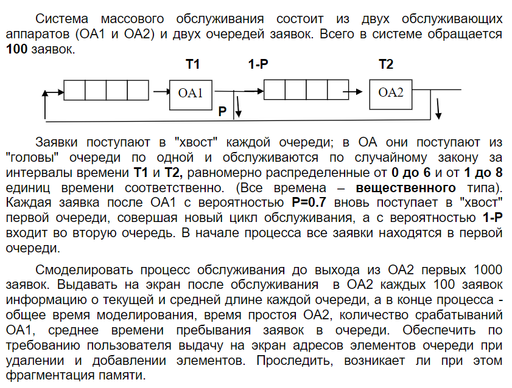

# Лабораторная работа №5. Обработка очередей.  
**Студент** Варин Дмитрий Владимирович  
**Группа** ИУ7-36Б  
**Вариант 3** 
## Цель
приобрести навыки работы с типом данных «очередь»,  
представленным в виде одномерного массива и односвязного линейного списка,  
провести сравнительный анализ реализации алгоритмов включения и  
исключения элементов из очереди при использовании указанных структур  
данных, оценить эффективности программы по времени и по используемому  
объему памяти.  
## Задание  

## Техническое задание  
### Входные данные
В зависимости от режима работы:  
1. Моделирование работы автоматов - входных данных нет.  
2. Работа с очередью, в зависимости от выполнимой операции ввод:
- Добавление элемента в очередь - **элемент очереди**;
- Удаление элемента из очереди - без входных данных;
- Печать очереди - без входных данных;  
- Печать списка свободных адресов - без входных данных;
- Добавление *N* элементов в очередь - **число N**;
- Выход - **команды для выхода - число 0**;
3. Завершение работы - **число 2**;
### Выходные данные
1. Состояние очереди на момент обработки **100 заявок вторым аппаратом**;  
2. Состояние очередь на момент обработки **1000 заявок вторым аппаратом**;  
3. В зависимости от функции работы с очередью (см. *Входные данные*).  
### Функции программы:  
1. Моделирование обработки очереди.  
2. Базовые операции с очередью.  
### Возможные аварийные ситуации
1. Некорректный ввод номера функции.  
*На входе*: число, не входящее в диапазон команд [0:2].  
*На выходе*: сообщение «Число должно быть от 0 до 2.»   
2. Добавление N элементов в очередь.    
*На входе*: число N, выходящее из диапазона [1:100];  
*На выходе* : сообщение «Некорректный ввод»;  
3. Добавление элемента в очередь.
*На входе*: не число;  
*На выходе*: сообщение «Некорректный ввод»;  
## Структуры данных

#### Структура хранения очереди
Для представления очередь используется 2 АТД:  
- Односвязный список;  
- Кольцевой массив;  

```c
typedef struct queue
{
    int size;
    queue_arr_t arr;
    queue_list_t list;
    double total_time;
    double avg_time;
} queue_t;
```
size - текущий размер очереди;   
array - кольцевой массив;  
list - связанный список;  
total_time - общее время обработки;  
avg_time - среднее время обработки.  

#### Структура хранения односвязного списка

```c
typedef struct list
{
    node_t *list_head;
} queue_list_t;
```
list_head - указатель на начало списка.  

```c
typedef struct node
{
    double time_service;
    double total_time;
    struct node *next_node;
} node_t;
```
time_service - время последнего обслуживания;  
total_time - общее время прибывания во всех очередях.

#### Структура хранения кольцевого массива

```c
typedef struct queue_arr
{
    array_element_t *beg;
    array_element_t *beg_initial;
    array_element_t *end;
    array_element_t *end_initial;
} queue_arr_t;
```
beg - текущее начало массива;  
beg_initial - «настоящее» начало массива;  
end - текущий конец массива;  
end_inital - «настоящий» конец массива.  

```c
typedef struct arr_elem
{
    double time_service;
    double total_time;
} array_element_t;
```
time_service - время последнего обслуживания;  
total_time - общее время прибывания во всех очередях.  
## Алгоритм
Сначала обрабатываются 100 заявок в первой очереди, подсчитывается время,  
которое для этого потребовалось. 
Затем, обрабатывается вторая очередь, в течении времени которое было затрачено для обработки первой очереди.   
Так продолжается, пока из второй очереди не выйдет 1000 заявок.  
## Тесты

Среднее время обработки в первой очереди: 1.5 секунды.

  | Вероятность выхода из первой очереди |  Ожидаемое время моделирования |  Реальное время моделирования
  |--------------------------------------|-------------------------------|------------------------------|
  | 0.3                                  |  5000 секунд                  |   4996 секунд                |
  | 0.5                                  |  4500 секунд                  |   4400 секунд                |
  | 0.7                                  |  4500 секунд                  |   4580 секунд                |

Среднее время обработки в первой очереди: 3 секунды.

  | Вероятность выхода из первой очереди |  Ожидаемое время моделирования | Реальное время моделирования |
  |--------------------------------------|--------------------------------|------------------------------|
  | 0.3                                  |  10000 секунд                  |  9950 секунд                |
  | 0.5                                  |  6000 секунд                   |  6075 секунд                 |
  | 0.7                                  |  4500 секунд                   |  4580 секунд                 |

### Время

#### Добавление элементов

  | Количество элементов |   Список    |     Массив  |
  |----------------------|-------------|-------------|
  | 10                   | 12100 тиков | 2550 тиков  |
  | 50                   | 25500 тиков | 11000 тиков |
  | 100                  | 47500 тиков | 22000 тиков |

#### Удаление элементов

  | Количество элементов |   Список     |     Массив  |
  |----------------------|--------------|-------------|
  | 10                   | 53000 тиков  | 2500 тиков  |
  | 50                   | 265000 тиков | 13200 тиков |
  | 100                  | 535000 тиков | 27000 тиков |

### Память

#### Занимаемая память

  | Количество элементов  |   Список   |   Массив   |
  |-----------------------|------------|------------|
  | 10                    | 240 байт   | 160 байт   |
  | 100                   | 2400 байт  | 1600 байт  |
  | 1000                  | 24000 байт | 16000 байт |

## Выводы по проделанной работе

Использование односвязного списка невыгодно при реализации очереди. Списки  
проигрывают и по памяти и по времени обработки. Но, когда заранее  
неизвестен максимальный размер очереди, то можно использовать односвязный  
список, так как в отличии от статического массива, списки ограничены  
только размером оперативной памяти. Также опытным путём удалось получить, что на  
моём ПК не происходит фрагментации памяти.  

## Контрольные вопросы

### Что такое очередь?  
Очередь - структура данных, для которой выполняется правило *FIFO*, то  
есть первым зашёл - первым вышел. Вход находится с одной стороны  
очереди, выход - с другой.  
### Каким образом, и какой объем памяти выделяется под хранение очереди при различной ее реализации?  
При хранении кольцевым массивом: кол-во элементов * размер одного
элемента очереди. А также память под хранение размера массива и его вместимости.  
Память выделяется на стеке при компиляции, если массив  
статический. Либо память выделяется в куче, если массив динамический.  
  
При хранении списком: кол-во элементов * (размер одного элемента  
очереди + указатель на следующий элемент). Память выделяется в куче для  
каждого элемента отдельно.  
### Каким образом освобождается память при удалении элемента из очереди при ее различной реализации?
При хранении кольцевым массивом память не освобождается, а просто  
меняется указатель на конец очереди. При хранении списком, память под  
удаляемый кусок освобождается.  

### Что происходит с элементами очереди при ее просмотре?  
Эти элементы удаляются из очереди.

### Каким образом эффективнее реализовывать очередь. От чего это зависит?  
Зная максимальный размер очереди, лучше всего использовать кольцевой
статический массив. Не зная максимальный размер, стоит использовать
связанный список, так как такую очередь можно будет переполнить только
если закончится оперативная память.

### Каковы достоинства и недостатки различных реализаций очереди в зависимости от выполняемых над ней операций?  
При использовании кольцевого массива тратится больше времени на
обработку операций с очередь, а так же может возникнуть фрагментация
памяти. При реализации статическим кольцевым массивом, очередь всегда
ограничена по размеру.  

### Что такое фрагментация памяти?  
Фрагментация памяти - разбиение памяти на куски, которые лежат не
рядом друг с другом. Можно сказать, что это чередование свободных и  
занятых кусков памяти.  

### На что необходимо обратить внимание при тестировании программы?
- Корректное освобождение памяти;
- Обработку ошибочных ситуаций;  
- Обработку пользовательского ввода.  

### Каким образом физически выделяется и освобождается память при динамических запросах?  
При запросе памяти, ОС находит подходящий блок памяти и записывает его в
«таблицу» занятой памяти. При освобождении, ОС удаляет этот блок памяти
из «таблицы» занятой пользователем памяти.  