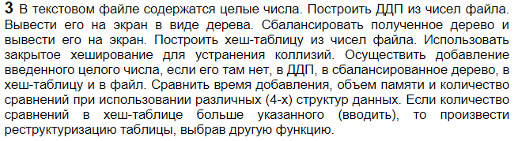

# Лабораторная работа №6. Деревья, хеш –таблицы.  
**Студент** Варин Дмитрий Владимирович  
**Группа** ИУ7-36Б  
**Вариант 3** 
## Цель
получить  навыки  применения  двоичных  деревьев, реализовать  основные  операции  над  деревьями:  
* обход  деревьев;
*  включение, исключение  и  поиск  узлов;  
построить  и  обработать  хеш-таблицы,  
сравнить эффективность  поиска  в  сбалансированных  деревьях,  в  двоичных  деревьях поиска и в хеш-таблицах.  
## Задание  

## Техническое задание  
### Входные данные
В зависимости от режима работы:  
1. Работа с деревьями: *ДДП* и *АВЛ*;  
- Ввод дерева *ДДП* из файла - число *1*, **номер рабочего файла**;
- Добавление числа в *ДДП* - число *2*,**уникальное число**;  
- Удаление числа из *ДДП* - число *3*, **удаляемое число**;  
- Вывод *ДДП* в файл для последующей отрисовки - число *4*,**номер команды**;  
- Балансировка *ДДП* - число *5*, **номер команды**;  
- Добавление числа в *АВЛ* - число *6*, **уникальное число**;  
- Удаление числа из *АВЛ* - число *7*, **удаляемое число**;  
- Вывод *АВЛ* в файл для последующей отрисовки - число *8*, **номер команды**;  
- Выход в главное меню - *число 0*;
2. Работа с хеш-таблицей - метод устранение коллизий *закрытое хеширование*;  
- Заполнение таблицы из файла - число *1*, **номер рабочего файла**;  
- Добавление числа в таблицу - число *2*, **уникальное число**; 
- Удаление числа из таблицы - число *3*, **удаляемое число**; 
- Вывод таблицы - число *4*;  
- Просмотр процента заполненности - число *5*;  
- Смена хеш функции - число *6*;  
- Смена кол-ва сравнений при возниковении коллизий - число *7*; 
- Выход в главное меню - число *0*;    
3. Замеры времени добавления в *ДДП*, *АВЛ*,*Хеш-таблицу*,*Файл*;  
- Заполнение АТД числами - *целое число*;  
### Выходные данные
1. В зависимости от функции работы с деревьями / таблицей. (см. *Входные данные*).  
2. Файл в расширении *.gv* для визуализации деревьев.  
3. Результаты замеров времени.  
### Функции программы:  
1. Визуализация деревьев.  
2. Базовые операции с деревьями.  
3. Базовые операции с таблицей.  
4. Замеры времени добавления в АТД.  
### Возможные аварийные ситуации
1. Некорректный ввод номера функции.  
*На входе*: число, не входящее в диапазон команд [0:4].  
*На выходе*: сообщение «Выбран неверный режим, повторите попытку»   
2. Добавление элемента, существующего в АТД.    
*На входе*: число N, выходящее из диапазона [1:100];  
*На выходе* : сообщение «Значение должно быть уникальным»;  
3. Удаление из пустого АТД.
*На входе*: число;  
*На выходе*: сообщение «Сначала нужно ввести <дерево/таблицу>»; 
4. Ввод неверного имени рабочего файла.
*На входе*: имя файла;  
*На выходе*: сообщение «Такого файла не найдено»;   
5. Некорректный ввод числа.  
*На входе*: число;  
*На выходе*: сообщение «Некорректный ввод числа»; 
6. Балансировка пустого дерева.  
*На входе*: ---;  
*На выходе*: сообщение «Введите ДДП, балансировать нечего.»;   
7. Распечатка пустого дерева.  
*На входе*: номер команды;  
*На выходе*: сообщение «<ДДП/АВЛ> не задано»;   
8. Ввод в таблицу уже существующего значения.
*На входе*: число;  
*На выходе*: сообщение «Элемент уже в таблице»;   
9. Превышено кол-во сравнений при коллизиях в таблице;  
*На входе*: число;  
*На выходе*: сообщение «Превышено кол-во сравнений»;  
10. Ошибка открытия файла.  
*На входе*: имя файла;  
*На выходе*: сообщение «Не удалось открыть файл»;  
## Структуры данных
В программе используется несколько АТД:  
#### Структура ДДП  
1. *Дерево двоичного поиска*.  
*ДДП* представлено следующей структурой. 
```C
struct tree_node {
    int data;
    struct tree_node *left;
    struct tree_node *right;
};

typedef struct tree_node tree_node_t;
```
`int data` - целое число;  
`struct tree_node *left` - указатель на левое поддерево;  
`struct tree_node *right` - указатель на правое поддерево;  

### Структура АВЛ
2. *АВЛ дерево*
*АВЛ дерево* представлено следующей структурой. 
```c
typedef struct avl_node avl_node_t;

struct avl_node {
    int data;
    int8_t height;
    avl_node_t *left;
    avl_node_t *right;
};
```
`int data` - целое число;  
`int8_t` - разность высот правого и левого поддеревьев;  
`avl_node_t *left` - указатель на левое поддерево;  
`avl_node_t *right` - указатель на правое поддерево;  

### Структура Хеш-таблицы
3. *Хеш - таблица*
*Хеш - таблица* представлено следующей структурой. 
```c
typedef struct {
    int value;
} ht_item;

typedef struct {
    int size; //prime num
    int base_size;
    int count;
    ht_item **ht_items;
} hash_table;
```
`int size` - размер таблицы - ближайшее простое к *base_size*;  
`int base_size` - исходный размер таблицы;  
`int count` - количество занятых ячеек таблицы;  
`ht_item **ht_items` - массив структур *ht_item*, хранящих целые числа;    
  

```c
typedef struct node
{
    double time_service;
    double total_time;
    struct node *next_node;
} node_t;
```
time_service - время последнего обслуживания;  
total_time - общее время прибывания во всех очередях.  
 
## Алгоритм
Для обработки деревьев используются стандартные алгориты работы с ними:  
- Поиск;
- Добавление;  
- Удаление;  
- Вывод;  
    
Также для балансировки используется алгоритм,  который перестраивает дерево в случаи разности высот поддеревьев большего по модулю 1.  
Данное действие осуществляется *с помощью поворотов*:  
- **LL** - малый левый поворот;  
- **LR** - большой левый поворот;  
- **RR** - малый правый поворот;  
- **RL** - большой правый поворот.  
    
Для хеширования таблицы используется *2 хеш-функции*:  
- метод деления;  
- полиномиальное хеширование (число представляется в виде строки);  
    
Коллизии разрешаются *методом закрытого хеширования*.  
## Тесты  
#### Добавление элементов
##### Время в абстрактных единицах

| Количество чисел | ДДП   | АВЛ    | Хеш-таблица | Файл   |
|------------------|-------|--------|-------------|--------|
| 10               | 1765  | 4144   | 1078        | 61045  |
| 20               | 2430  | 5832   | 1448        | 65793  |
| 50               | 10539 | 25485  | 5266        | 72980  |
| 100              | 26832 | 60267  | 13888       | 98074  |
| 250              | 81586 | 138857 | 55748       | 155719 |

##### Занимаемая оперативная память в байтах

| Количество чисел | ДДП  | АВЛ  | Хеш-таблица | Файл |
|------------------|------|------|-------------|------|
| 10               | 240  | 240  | 64          | 0    |
| 20               | 480  | 480  | 128         | 0    |
| 50               | 1200 | 1200 | 224         | 0    |
| 100              | 2400 | 2400 | 424         | 0    |
| 250              | 6000 | 6000 | 1024        | 0    |

## Выводы по проделанной работе

Основным преимуществом рассмотренных структур данных является возможная высокая эффективность алгоритмов добавления, поиска, удаления элементов в сравнении, например, с массивами.  
Среднее время выполнения этих операций для таблиц намного меньше (для добавления нужно в среднем в 2 раза больше времени для ДДП, и в 3.5 раза больше для АВЛ-дерева), чем для деревьев.  
Так же, для хранения хеш-таблицы нужно в 3-4 раза меньше памяти, чем для хранения деревьев.  
Однако, у деревьев есть по одно заметное преимущество по сравнению с хеш-таблицей:  
в них можно выполнить проход по возрастанию или убыванию ключей и сделать это быстро.  
Стоит отметить, что время добавление в файл будет всегда  константным, потому что перемещение каретки в конец файла   происходит за константное время. Поэтому, выбор структур данных   напрямую зависит от области их применения.  

## Контрольные вопросы

### Что такое дерево?  
Дерево – это рекурсивная структура данных, используемая для представления иерархических связей, имеющих отношение *один ко многим*   
### Как выделяется память под представление деревьев?  
В виде односвязного списка — динамически под каждый узел дерева.  
### Какие стандартные операции возможны над деревьями?  
Обход дерева, поиск по дереву, включение в дерево, исключение из дерева.  
 
### Что такое дерево двоичного поиска?  
Двоичное дерево, для каждого узла которого сохраняется условие:  
- Левый потомок меньше родителя;  
- Правый потомок больше родителя.  

### Чем отличается идеально сбалансированное дерево от АВЛ дерева?    
У АВЛ дерева для каждой его вершины высота двух её поддеревьев различается не более чем на 1.  
У идеально сбалансированного дерева различается количество вершин в каждом поддереве не более чем на 1.  

### Чем отличается поиск в АВЛ-дереве от поиска в дереве двоичного поиска?  
Поиск в АВЛ дереве происходит быстрее, чем  в ДДП.  

### Что такое хеш-таблица, каков принцип ее построения?   
Хеш-таблицей - это массив, заполненный элементами в порядке,
определяемом хеш-функцией.  
Хеш-функция каждому элементу таблицы ставит в соответствие некоторый индекс.  
Функция должна быть простой для вычисления,распределять ключи в таблице равномерно и давать минимум коллизий.  

### Что такое коллизии? Каковы методы их устранения.  
Коллизия – ситуация, когда разным ключам хеш-функция ставит в соответствие один и тот же индекс.  
Основные методы устранения коллизий:
- открытое хеширование;  
- закрытое хеширование.  
При открытом хешировании к ячейке по данному ключу прибавляется связанны список.  
При закрытом – новый элемент кладется в ближайшую свободную ячейку после данной.  

### В каком случае поиск в хеш-таблицах становится неэффективен?  
Поиск в Хеш-таблицах становится неэффективен при большом числе коллизий.  
Сложность поиска возрастает по сравнению с 
`О(1)`.  
В этом случае требуется реструктуризация таблицы:  
заполнение её с использованием новой хеш-функции.  

### Эффективность поиска в АВЛ деревьях, в дереве двоичного поиска и в хеш-таблицах.  

В хеш-таблице минимальное время поиска `О(1)`  
В АВЛ: `О(log2n)`  
В ДДП `О(h)`,  
где `h`- высота дерева (от log2n до n).  
